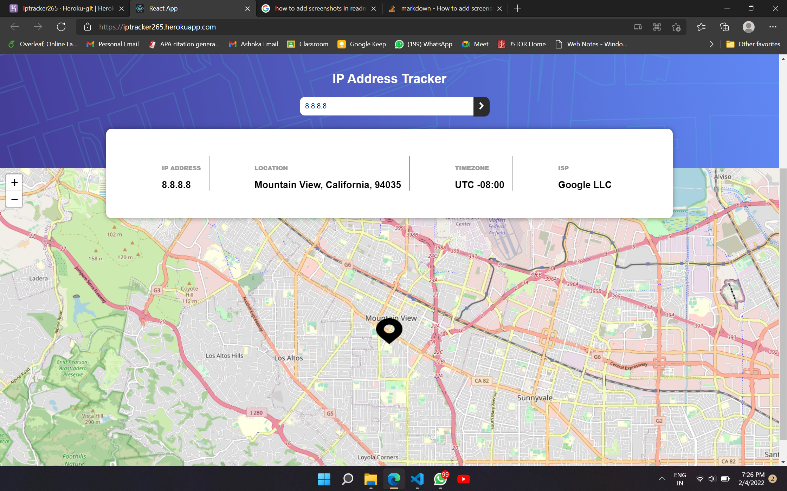
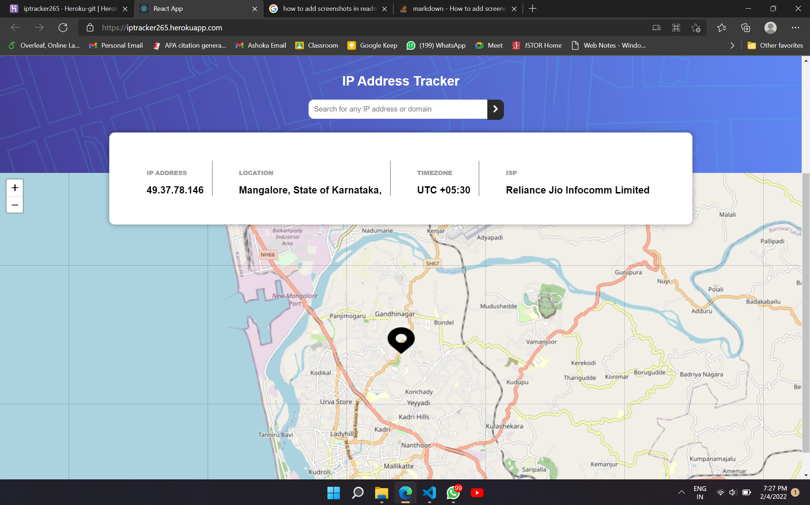
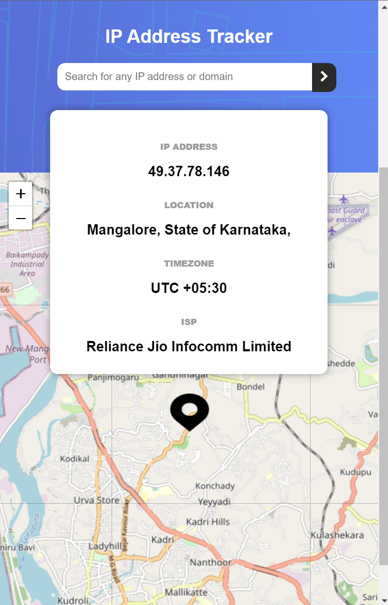
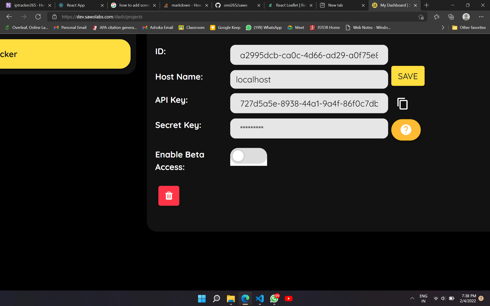
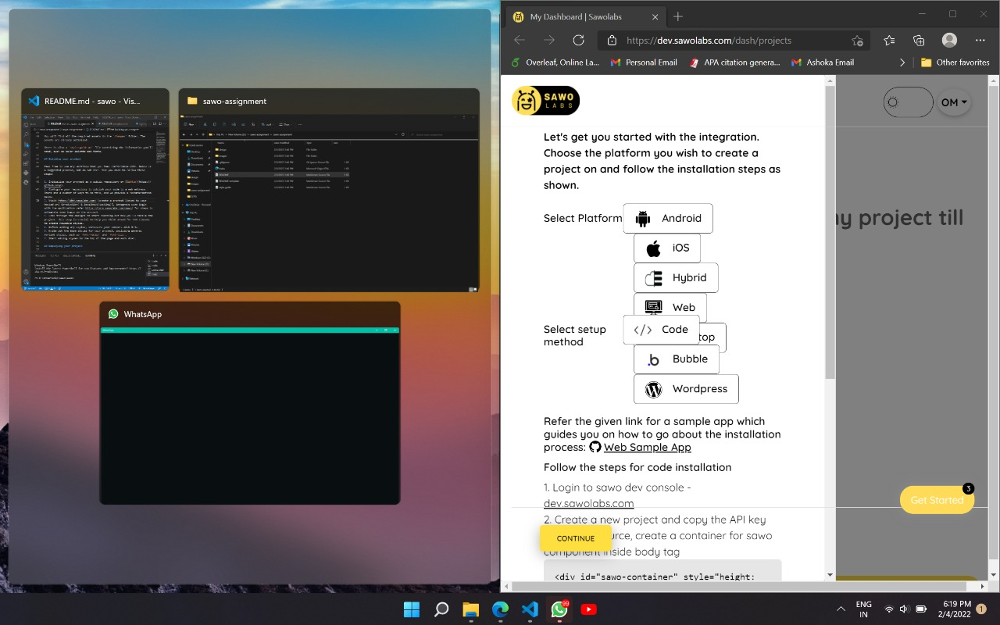

## Table of contents

- [Overview](#overview)
  - [The challenge](#the-challenge)
  - [Screenshot](#screenshot)
  - [Links](#links)
- [My process](#my-process)
  - [Built with](#built-with)

**Note: Delete this note and update the table of contents based on what sections you keep.**

## Overview

### The challenge

Users should be able to:

- Login using SAWO sdk (the passwordless way)
- View the optimal layout for each page depending on their device's screen size
- See their own IP address on the map on the initial page load
- Search for any IP addresses or domains and see the key information and location

### Screenshot

### Links

- Solution URL: https://github.com/omi265/sawo
- Live Site URL: https://iptracker265.herokuapp.com/

## My process

- Creating a react-leaflet [React-Leaflet](https://react-leaflet.js.org/) Map environment to map coordinates
- integrating a searchbox to take user input
- Fetching details according to the user input from the  [IP Geolocation API by IPify](https://geo.ipify.org/) API.
- Using the response json to populate the values for mapping and description.
- Designing the Landing page using CSS.
- implementing the SAWO sdk Login setup. 

### Built with

- Semantic HTML5 markup
- CSS custom properties
- Flexbox
- CSS Grid
- Mobile-first workflow
- [React](https://reactjs.org/) - JS library
- [Next.js](https://nextjs.org/) - React framework
- [IP Geolocation API by IPify](https://geo.ipify.org/)
- [LeafletJS](https://leafletjs.com/)
- [React-Leaflet](https://react-leaflet.js.org/)

### Bugs Found
These were a few bugs i found on the Sawo website while i was going through it.
- 
- 
